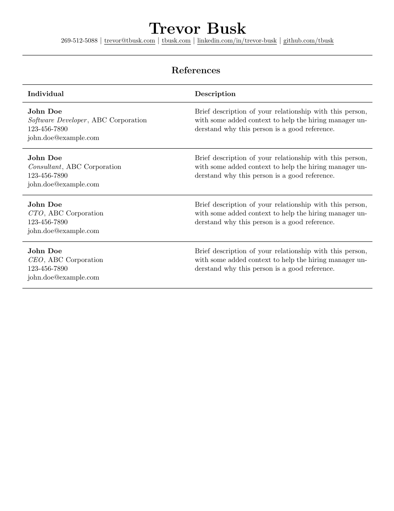

# LaTeX Software Engineer References Template

This is a references template I created with my twist that is:

- Single-page
- One column
- Made up of modular components, of which the underlying details are abstracted

## Preview



## Getting Started

To get started, you can add things to the document starting between the `begin` and the `end` portions.

```latex
\begin{document}
    % anything you want
\end{document}
```

### Building

To build the PDF, you will need to install `texlive` and build using `latexmk`.

You likely will need to install dependencies, but on the Solus Linux Distrobution, you only need `texlive` and
`latexmk`.

You can build a PDF without keeping the extra output files using the following command:

```shell
latexmk -pdf References.tex && latexmk -c
```

This first half will build the pdf and the rest will clean up the extra files.

### Header

The header is the topmost item in the references template.

It contains your phone number, email address, website, LinkedIn, and GitHub links. Add or remove items as necessary from
the original component.

```latex
\rHeader
```

### Variables

The document uses variables to simplify the experience.

Your contact details and socials:

- `\myName{}`: Your Full Name
- `\myPhoneNumberCondensed{}`: Your phone number in a condensed format (e.g., 1234567890)
- `\myPhoneNumberPretty{}`: Your phone number in a pretty format (e.g., (123) 456-7890)
- `\myEmailAddress{}`: Your email address
- `\myWebsite{}`: Your website URL
- `\myLinkedIn{}`: Your LinkedIn profile URL
- `\myGitHub{}`: Your GitHub profile URL

### Heading

This component adds "References", center aligned, large, with a horizontal line below it.

Usage:

```latex
\rHeading
```

### Table

The references table is made up of two components:

- `reference header`
- `reference`

The table has two columns:

- `Individual`: Details of the reference like name, title, company, phone number, and email address
- `Description`: Description of how you know the reference and anything the hiring manager should know.

The header just shows the column names, and the table items are where the details are added.

Reference Header Usage:

```latex
\rReferenceHeading
```

Reference Usage:

```latex
\rReference{name}{job title}{company name}{phone number}{email address}{description}
```

### Links

You can add a link to something pretty easily

It has two parameters, the first is the full url, and the second is what the user actually sees.

```latex
\href{full url}{user-facing display}
```

### Spacing

You can add more spacing or adjust it for something pretty easily. Use either the `hspace` or `vspace` depending if you
want to add vertical or horizontal spacing.

#### Horizontal

```latex
\hspace{1pt}
```

#### Vertical

```latex
\vspace{1pt}
```

### Bolding

You can make something bold by using

```latex
\textbf{text}
```

### Italicization

You can make something italicized by using

```latex
\textit{text}
```

## Additional Resources

- [Latexmk Documentation](https://mgeier.github.io/latexmk.html)

## License

This project is licensed under the [MIT License](https://opensource.org/licenses/MIT) found [here](LICENSE).